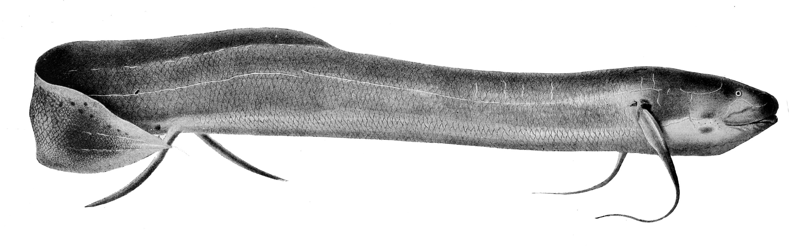

## [back](../index.md) 
# African lungfish
Learn how to keep the African lungfish, a long-lived and hardy freshwater fish, in your aquarium. Find out its natural habitat, appearance, behavior, diet, tank mates, and more. A West African lungfish lung and gill cell type atlas. To study cell type diversity, we generated scRNA-seq data of lungs and gills from three West African lungfishes maintained under ... The ability of African Lungfish to sit out the annual drying-up of its habitat by constructing a cocoon underground and entering aestivation is a level of resilience at odds with our mammalian impressions of the world and has fascinated biologists for centuries. Our appreciation for this remarkable persistence should only blossom as science ... The six species of lungfish possess both lungs and gills and are the closest extant relatives of tetrapods. Here, we report a single-cell transcriptome atlas of the West African lungfish (Protopterus annectens).This species manifests the most extreme form of terrestrialization, a life history strategy to survive dry periods that can last for years, characterized by dormancy and reversible ... The West African lungfish is a remarkable creature, bridging the gap between aquatic and terrestrial life with its unique adaptations. Its ability to survive in varying conditions, from water to mud and even dormancy periods, is incredible. As we marvel at its existence, it serves as a reminder of our planet's wonders and the importance of ...

