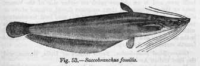

## [back](../index.md) 
# Airsac catfish
Common fish that start with the letter A include Arowana, Atlantic cod, Australian lungfish, Asian carp, African catfish, Antarctic icefish, American eel, Archerfish, Amazon river dolphin, Ansorge's Neolebias, Australian Swamp Eel, and Albino Driftwood Cat. At the end of this article, we will have a comprehensive list of all 85+ fish ... ObjectiveFreshwater catfish are known to cause painful stings in humans. Stings usually cause mild envenomation and, in some instances, can lead to severe secondary bacterial infections. Sri Lanka ... The global review of catfish research, mapped through these co-citation clusters, unveils a multidisciplinary landscape. From taxonomical pursuits and immune dynamics to environmental interactions and sensory biology, these insights capture the complexity and richness of catfish research. 3.5. Find Heteropneustes stock images in HD and millions of other royalty-free stock photos, 3D objects, illustrations and vectors in the Shutterstock collection. Thousands of new, high-quality pictures added every day. Air sac trematodes (Digenea: Cyclocoelidae) were detected in 23 avian species from eight aviaries in the United States. Most of the infected host species were passeriform birds, but a few species in other orders also were infected. Four species of adult flukes were encountered: Circumvitellatrema momota, Morishitium sp., Psophiatrema greineri, and Szidatitrema yamagutii. Findings from ...

