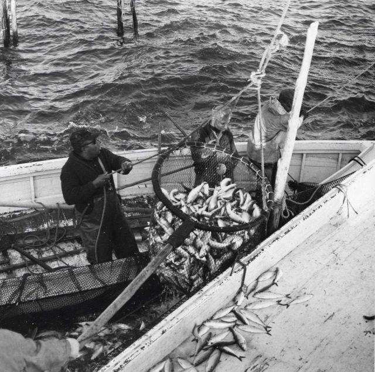

## [back](../index.md) 
# Alewife (fish)
River herring (alewife and blueback herring) are migratory fish that range along the East Coast from Florida to Maine. They spend most of their life cycle in the marine environment, returning every four to five years to their natal rivers to spawn. Juvenile river herring typically migrate back to the marine environment in the fall. Each spring, alewife herrings return to spawn in New England rivers. In recent years, the removal of dams has led to a resurgence of the little fish that are a key part of the food chain. Alewives are small forage fish that don't live very long lives, often living for up to 10 years. Cassidy Best / CC BY 4.0. A departure from popular sportfish like salmon and bass, the alewife is something between a small-sized "forage fish" and a trout although they are more closely related to shads. The alewife has a laterally compressed, silver body and a conspicuous eyespot behind its ... Dammed But Not Doomed. As dams come down on the Skutik River, the once-demonized alewife—a fish beloved by the Passamaquoddy—gets a second chance at life. Heroic fish tales tend to focus on species with a certain je ne sais quoi: the leaping salmon, the globetrotting tuna, the mammoth marlin towering above its captor as it dangles from a scale. February 12, 2024. Alewives may soon be returning to Maine's Mattamiscontis Lake. For the Penobscot Nation, the Indigenous people who have fished the waters of the North Woods for 12,000 years, the return of these silvery slivers of foot-long fish is a reason to celebrate. In the Penobscot language, "Mattamiscontis" translates to "place ...

