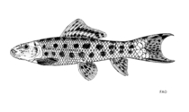

## [back](../index.md) 
# Algae eater
Learn about 20 different species of algae-eating fish, snails, and shrimp that can help you keep your aquarium clean and healthy. Find out their benefits, requirements, and compatibility with other tank mates. Learn about different types of algae eaters for freshwater aquariums, such as catfish, shrimp, snails, and loaches. Find out their characteristics, benefits, and compatibility with other tank mates. 3. Clown Pleco (Panaqolus maccus) Minimum tank size: 20 gallons. Clown plecos are great little algae eaters for smaller tanks. This species only grows to about 3 inches long and they'll eat soft algae off of rocks, plants and the glass. They're not great for tougher algae, like black beard or green spot. The slender, unassuming Siamese algae eater (SAE) is an alga devouring powerhouse. Happy to feast on multiple algae types, this fish will even attack beard algae, which other species will not do.. They reach around six inches (15 cm) in length when fully grown. They are constantly in motion and may bother timid fish with their activity level. Siamese Algae Eater. Crossocheilus oblongus, aka Siamese algae eater, is a small six-inch fish that is usually used in larger freshwater aquariums. These fish have downturned mouths, which are perfect for eating black beard algae, hair algae, and leftover food scraps in a fish tank.

