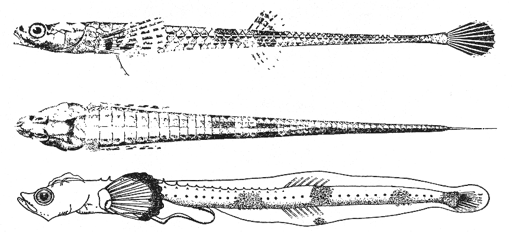

## [back](../index.md) 
# Alligatorfish
The greatest differences between a Florida gar and an alligator gar lie in their size and range. The alligator gar is a large fish, weighing between 100 and 350 pounds and measuring between 6 and 10 feet long. The Florida gar is a smaller fish weighing between 3 and 10 pounds while measuring about 1.8 to 4.4 feet in length. also known as the alligatorfish or the alligator garfish, is a unique and interesting species of fish belonging to the family Syngnathidae. This family of fish includes seahorses, pipefishes, and seadragons. The Alligator Pipefish is a relatively large pipefish, growing up to 24 inches (60 cm) in length. It has a long, slender body that ... Monkfish is a delicious fish loved by many seafood connoisseurs. It is also referred to as "alligatorfish", "anglerfish", or "goose fish". It was once difficult to find monkfish in grocery stores, but nowadays it is becoming easier to find fresh monkfish in many seafood markets. Monkfish is both tasty and nutritious. It is low in ... Discover Life's page about the biology, natural history, ecology, identification and distribution of Aspidophoroides bartoni - Aleutian Alligatorfish -- Discover Life Discover Life's page about the biology, natural history, ecology, identification and distribution of Anoplagonus inermis - Smooth Alligatorfish -- Discover Life D I S C O V E R L I F E Home • All Living Things • IDnature guides • Global mapper • Albums • Labels • Search

