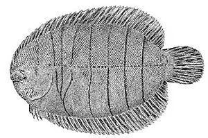

## [back](../index.md) 
# American sole
American Sole is a family of fish with small, barely noticeable heads and their high tolerance for fresh water. They're a different family to European Soles, although the most popular ones are named after species in Britain. On the Pacific Coast, they include English, Petrale, Curlfin, and Pacific Dover Sole (not the same as European Dover ... Petrale Sole is a popular type of flatfish with a sweet and buttery flavor that is commonly found on the west coast of the United States. While there are other types of sole available, Petrale Sole's delicate texture and sustainability make it a great option for seafood lovers. In this blog post, we compare Petrale Sole to other types of sole ... 7. American Sole. Sanddabs typically has an oval-shaped body with a light tan or brown coloration covered in dark spots and speckles. ©J.R. Sosky/Shutterstock.com. American sole fish Achiridae, commonly known as sand dabs, are small flatfish that can be found living in shallow water along the North American coast from Alaska to Mexico. American sole, American freshwater flounder, American flounder, hogchoker, drab sole: Origin: Freshwater regions in South America, including the Amazon, Orinoco, and Essequibo water systems: Habitat: Freshwater rivers, typically with muddy or sandy substrates; in estuaries for some species: The Freshwater Sole Brachirus panoides is a freshwater member of the Soleidae Famiiy of "true soles" that occurs worldwide. Most sole fish species live in the ocean but a few smaller ones inhabit fresh water or brackish water. It is also called the False Freshwater Sole and False Pan Sole, as well as Tonguefish, Pan Sole, and Hogchoker Sole.

