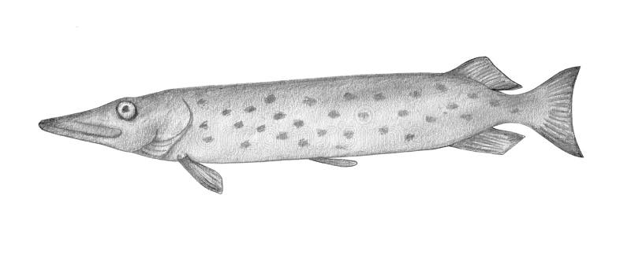

## [back](../index.md) 
# Amur pike
The last amur pike were spawned in 1971 and the Commission's entire brood stock was lost in 1976. The amur pike is also known as blackspotted pike and is native only to the Amur river drainage in China. At this time the Pennsylvania population is considered to be non-existent with the last observation occurring in 1991. 4. Amur Pike (Esox reichertii) The Amur Pike, also known as the Asian Pike, is a formidable predator in Mongolian waters. These fish can get quite large, with some even growing longer than three feet. Anglers targeting Amur Pike often use heavy gear due to their aggressive nature and sharp teeth. Amur Pike (Esox reichertii): Also known as the black-spotted pike, it is native to the Amur River system in East Asia, which straddles China, Mongolia, and Russia. Aquitanian Pike (Esox aquitanicus): Native to the southwestern region of France, this species was first recognized in 2014, so not much is known about it. Northern Pike is a muscle-building machine packed with high-quality protein to fuel your body's repair and growth. Just a 3-ounce serving of raw Northern Pike provides an impressive 16.37 grams of protein, perfect for those looking to bulk up or recover after an intense workout. Omega-3 Fatty Acids Galore Discover Life's page about the biology, natural history, ecology, identification and distribution of Esox reichertii - Amur Pike -- Discover Life D I S C O V E R L I F E Home • All Living Things • IDnature guides • Global mapper • Albums • Labels • Search About • News • ...

