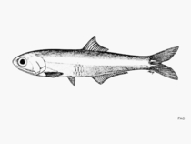

## [back](../index.md) 
# Anchovy
Anchovy is a term for various small, schooling saltwater fishes of the family Engraulidae. Learn about their characteristics, habitats, diets, and roles in the food chain and human culture. Anchovies are versatile, salty, and meaty fish that can add umami to pastas, salads, meats, snacks, and more. Learn how to pick, store, and cook with anchovies, and get recipes for anchovy butter, bagna cauda, Caesar salad, and more. 5th Place: Agostino Recca Jar (6.3/10) From here on out, the mean and median scores look significantly different, and tasters were extremely split—in fact, the Agostino Recca Jar ($1.76/oz.) garnered some of the highest and lowest scores doled out during the taste test. Learn about anchovies, a small omega-3 rich fish that are available in various forms. Find out their nutrition facts, health benefits, and how to use them in your diet. Larval Stage: After hatching, anchovy larvae are tiny and nearly transparent.They are highly vulnerable during this stage and drift with ocean currents. Larvae mainly feed on plankton. Juvenile Stage: As they grow, anchovy juveniles start to resemble miniature versions of adult fish.They move closer to coastal areas, where they find abundant food sources and protection from predators.

