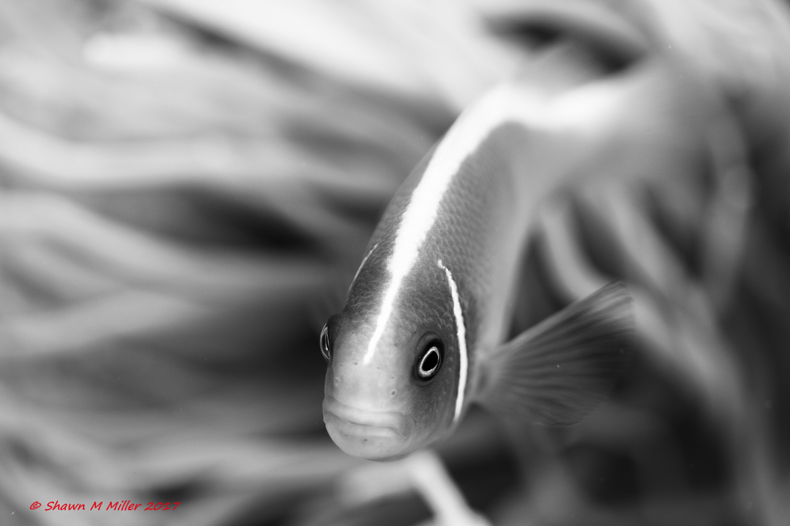

## [back](../index.md) 
# Anemonefish
Anemone fish are small fishes that live among sea anemones, avoiding their stinging cells. Learn about their characteristics, distribution, behavior and symbiosis with anemones from Britannica. Video recording of sea anemone selection by a yellowtail anemonefish when placed inside an experiment tank. Credit: Kashimoto et al., 2023. The scientists discovered that anemonefish are better at ... 2. , describing the specific relationships between the anemonefish and their host should be revisited. It is striking that these two fish species can recognize distinct lineages that taxonomists have not been able to clearly separate until now. In this sense, anemonefish appear to be better 'taxonomists' than humans. Anemonefish are most recognizable due to their symbiotic mutualisms with sea anemones. While you can identify anemonefish by different factors such as: Coloring. Stripes. Stripe patterns. Stripe location. Another great means to identify an anemonefish is by the host anemone. Some anemone fish can only cohabitate with a particular breed of ... Learn about the common clown fish, also known as anemone fish, a species of tropical marine fish that lives in symbiosis with sea anemones. Find out how it changes sex, breeds, and defends itself from predators.

