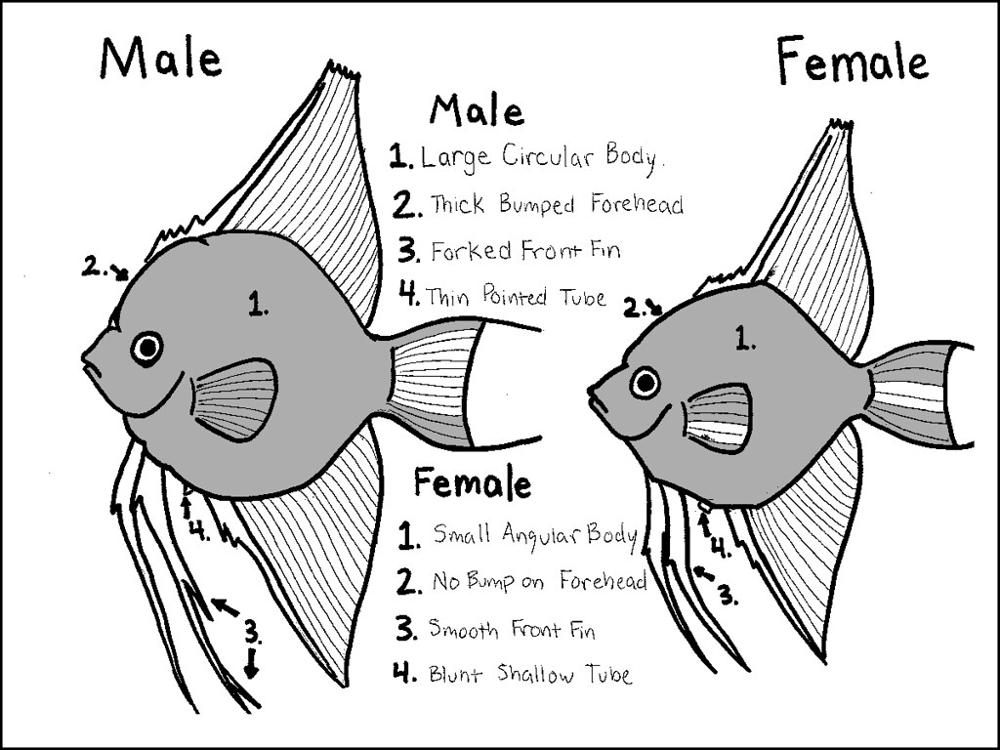

## [back](../index.md) 
# Angelfish (disambiguation)
Silver Angelfish. The Silver Angelfish is a classic and popular variety appreciated for its subtle elegance and shimmering appearance. Their monochromatic coloration highlights their graceful finnage, creating a refined aesthetic addition to any aquarium. Appearance: Tall, compressed body with elongated, tapering fins. Black Veil Angelfish. Image Credit: Omariam, Shutterstock. Another of the veil angelfish species, the black veil angelfish requires more room than a lot of other strains: around twice as much room so a 30-gallon tank will only be suitable for two. 11. Blushing Angelfish. Image Credit: J E Hollingsworth, Shutterstock. The male angelfish closely follows the female during this process, fertilizing the eggs as they are laid. This synchronized effort ensures successful reproduction. Angelfish are known to lay a large number of eggs, sometimes up to several hundred at a time. The eggs are adhesive and stick to the chosen surface, forming a cluster. Temperature: 76°F to 86°F. PH: 6.5-7.5. Genus: Pterophyllum. Species: Scalare. Most freshwater angelfish you find in fish stores are about 3-4 months old, and between the size of a quarter to a silver dollar. While small and adorable, those little fish won't stay small. Angelfish can grow up to 6" long, from nose to tail and most of an ... Angelfish Species: Pterophyllum scalare Adult Size: 6 inches long, 8 inches deep; Color: silvery-white and orange; Unique Traits: Red head cap; The redcap angelfish (video source) is a distinctive breed with a white body and orange 'cap'.The orange coloration extends roughly from the fish's mouth to the start of the dorsal fin.

