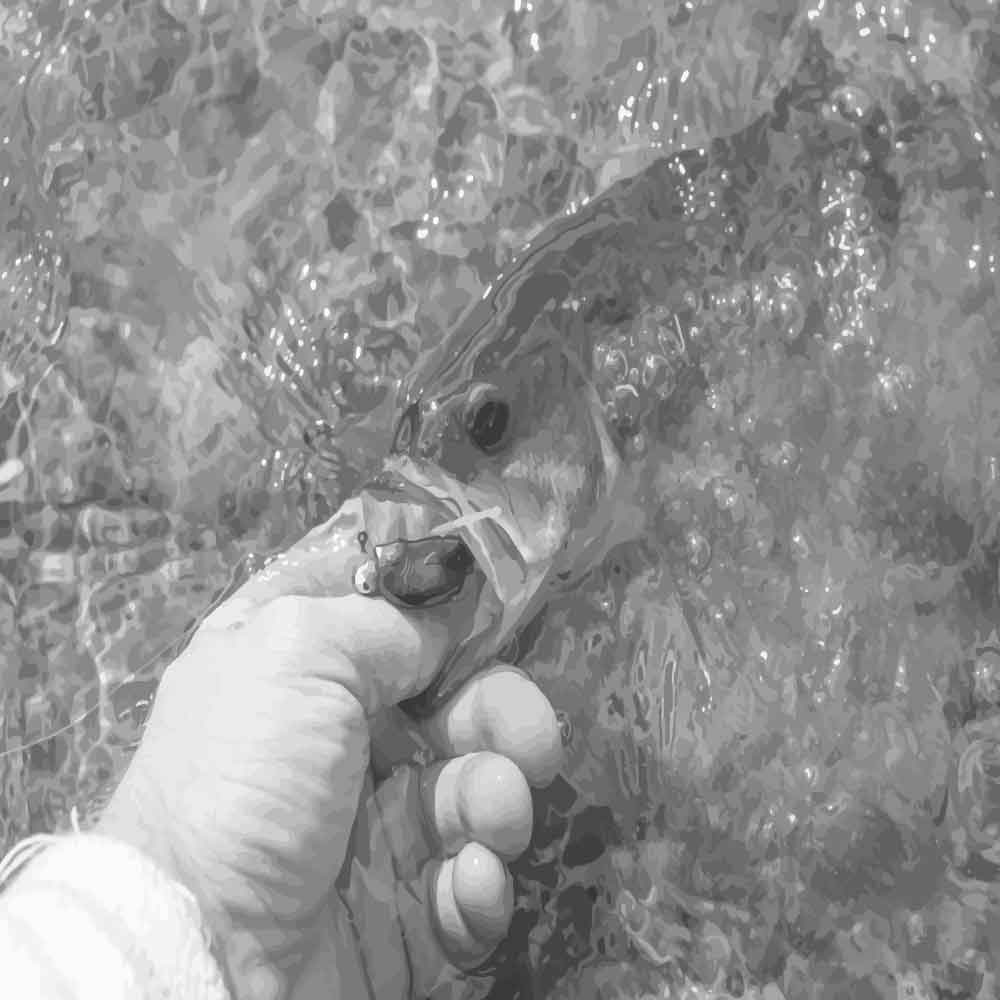

## [back](../index.md) 
# Angler catfish
The blue catfish is the largest species that U.S. anglers will encounter, with 100-plus pounders being somewhat common. That said, blues in the 4 to 10 pound-class are far more typical. Alessandro Biancardi, an Italian angler, pulled an enormous, 9.4-foot-long (2.85 meters) catfish from the shallow waters of the River Po in the Lombardy region of northern Italy. The catch beats ... The topwaters get too warm for bait fish on a hot summer's day. They also feel safer in open water under cover of darkness. Catfish are scent-based hunters, though, and have no problem tracking down forage in the dark. Daytime Catfishing. Catching Catfish during the day is a lot easier from a boat because you can get out to the deeper waters. Angler Justin Hall of Reidsville, North Carolina has officially broken the state record for channel catfish. He caught a 27-pound, 7-ounce channel cat from a farm pond near his home on May 21, which the North Carolina Wildlife Resources Commission recently certified as a new state record, according to FOX Carolina. The best time for bank anglers to target channel catfish at Konawa Lake is during the spring and into early summer when they spend more time in the shallow water. Live worms, stink bait, chicken liver and cut baits all tend to be productive fishing around the edges of the weed beds and riprap. Fishing Contact (405) 379-5408. Game Warden (405 ...

