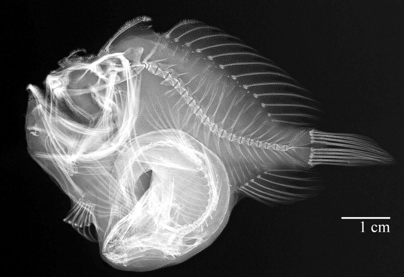

## [back](../index.md) 
# Anglerfish
Learn about anglerfish, marine fishes with a modified dorsal fin spine that lures prey. Find out how they live, feed, and reproduce, and see examples of different anglerfish groups. Learn about the anglerfish, a deep-sea predator with a glowing lure on its head to attract unsuspecting prey. Find out its scientific classification, conservation status, types, appearance, diet, and more. See pictures and videos of different species of anglerfish and their lures. Pelagic anglerfish species live in shallower parts of the ocean, away from the seafloor. Pelagic varieties of anglerfish include frogfish, monkfish, batfish, and goosefish. Deep sea anglerfish species tend to be bulbous, with rounded bodies, while pelagic species are almost always flat like stingrays . 6. When scientists began pulling anglerfish from the deep ocean, they noticed something odd—all of the specimens were female, and many of them had small parasites attached to their bodies. And when they studied the fish in detail, the story got even odder—the "parasites" were actually the missing males.Deep-sea anglerfish are some of the strangest creatures in the oceans. More than 200 species of anglerfish live in the world's oceans, with some dwelling as deep as 8,200 feet. Because they inhabit the so-called "midnight zone"—an area so far beneath the ...

