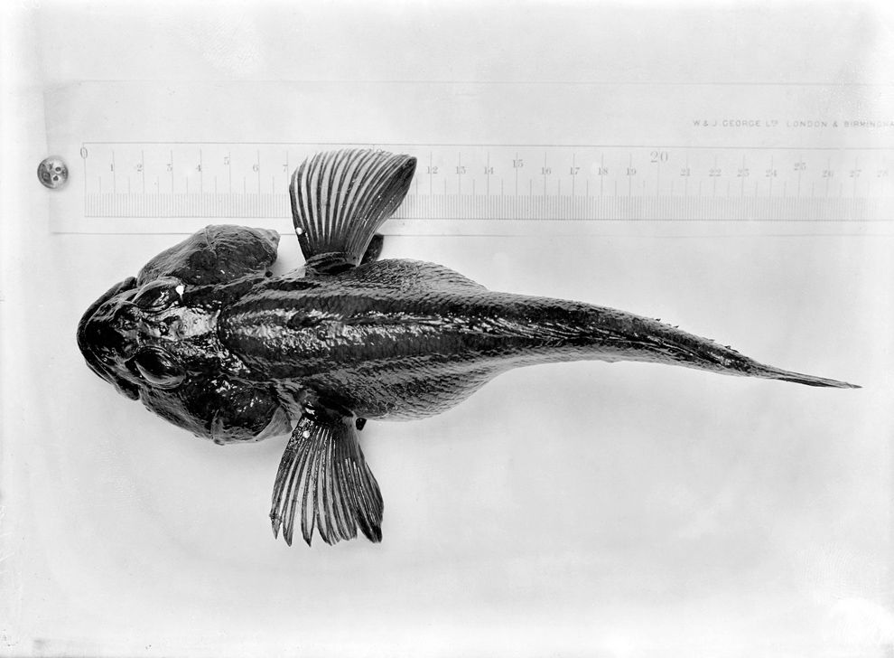

## [back](../index.md) 
# Antarctic cod
Travel Guide Wildlife Antarctic Fish & Crustaceans: Toothfish, Icefish, Krill & Other Species July 12th, 2023 • 11 min read Jump to Section Antarctic Crustaceans The Antarctic Krill Other Antarctic Crustaceans Crustacean Surprises (and Crustacean Nightmares) Antarctic Fishes The Nothothenioides Antarctic & Patagonian Toothfishes Gadus Scientific Name Gadus spp. Read our Complete Guide to Classification of Animals. Codfish Conservation Status Vulnerable Codfish Locations Ocean Codfish Facts Prey Smaller fish, shellfish, crustaceans, worms Group Behavior School Fun Fact Atlantic cod is found in the Northwest Atlantic Ocean from Greenland to North Carolina and in the western Gulf of Maine. Colors Atlantic cod is brownish, greenish to light yellowish with small, dark spots and a light lateral line running down the body. Seals are also common, but if you decide to look out for the ocean dwellers, there are about 235 species to look out for. This includes everything from mud-dwelling worms to antarctic fish with antifreeze, such as icefish or Antarctic cod. Let's just say Antarctica is one unique place that's an unforgettable experience calling out your name. 8 Citations 105 Altmetric Metrics Abstract Numerous novel adaptations characterise the radiation of notothenioids, the dominant fish group in the freezing seas of the Southern Ocean.

