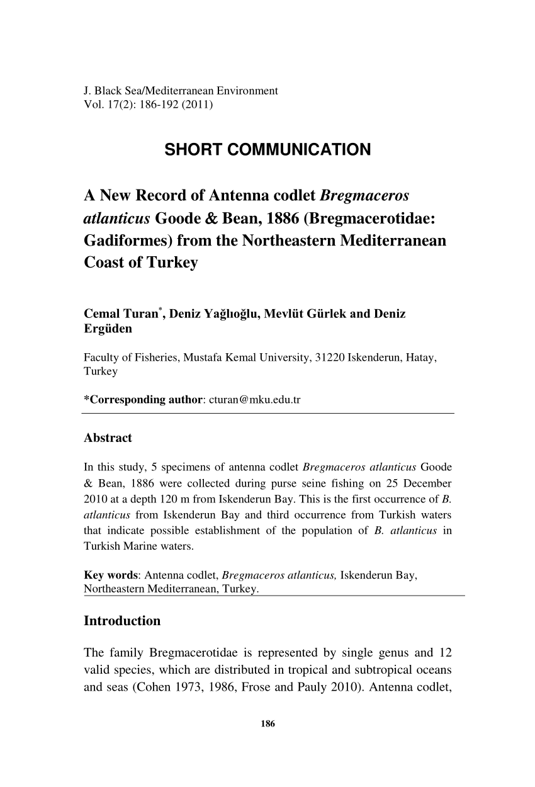

## [back](../index.md) 
# Antenna codlet
Discover Life's page about the biology, natural history, ecology, identification and distribution of Bregmaceros atlanticus - Antenna Codlet -- Discover Life D I S C O V E R L I F E Home • All Living Things • IDnature guides • Global mapper • Albums • Labels • Search Antenna codlet, Bregmaceros atlanticus Goode and Bean, 1886 (off south Cape and Natal coasts; circumtropical) Spotted codlet , Bregmaceros mcclellandi Thompson, 1840 (from Cape eastwards; circumtropical but not known from east Pacific) [4] [90] español : Overview: Main identification features. elongate, silvery; 1 long dorsal fin spine on head; dorsal fin and a; long base, high front, low center Fishes of the Greater Caribbean Discover Life's page about the biology, natural history, ecology, identification and distribution of Bregmaceros atlanticus - Antenna Codlet -- Discover Life mobile

