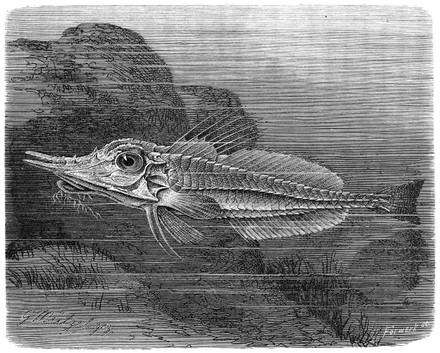

## [back](../index.md) 
# Armored gurnard
Robust Armored Gurnard Satyrichthys welchi is a strange looking fish. It is a member of the armored searobin family an occurs most frequently in North West Australian waters but has also been found as far North as Japan and as far east as the east coast of Africa. The plain helmet gurnard fish Dactyloptena tiltoni Eschmeyer (1997) is reported for the first time from the Arabian Sea based on a single female specimen measuring 295 mm standard length. The specimen was collected from bycatch landings in a multi-day shrimp trawl fishery at a depth ranging between 300 and 400 m from Sakthikulangara fishing harbour, Kerala. This species has previously been ... gurnard: 1 n bottom-dwelling coastal fishes with spiny armored heads and fingerlike pectoral fins used for crawling along the sea bottom Types: show 4 types... hide 4 types... Trigla lucerna , tub gurnard , yellow gurnard a kind of gurnard sea robin , searobin American gurnard; mostly found in bays and estuaries Prionotus carolinus , northern ... Peristedion longicornutum, a new species of armored gurnard from the western Pacific Ocean (Teleostei: Peristediidae). Journal. Journal of the Ocean Science Foundation. Suffix. 28: 90-102. Type. Publication Export. RIS (EndNote, Reference Manager, ProCite, RefWorks) BibTex (BibDesk, LaTeX) Sessions. Date. action. by. 2020-08-18 07:07:42Z ... Marine Species Traits editorial board (2023). Marine Species Traits. Peristedion longicornutum Fricke, Kawai, Yato & Motomura, 2017. Accessed at: https://www ...

