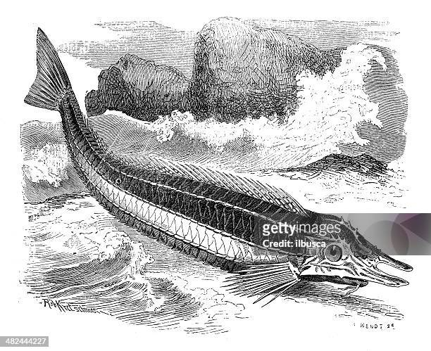

## [back](../index.md) 
# Armored searobin
The armored searobin is a unique fish species known for its ability to "walk" along the ocean floor. Utilizing its pectoral fin, which resembles legs, it moves in a manner that mirrors walking, enabling it to navigate the seabed. These fins resemble legs and are robust, making Armored Searobins stand out among many fish. For today's daily dose of deep-sea weird, meet the armored searobin! These unusual fish use modified fins to move across the seafloor and branched "whiskers"... devil's spine48. armored searobin - 0:0249. cusk eel - 0:1750. snake mackerel - 0:3251. pale skate - 0:4752. ghost shark - 1:0153. frilled shark - 1:1854. vo... During the Océano Profundo 2015: Exploring Puerto Rico's Seamounts, Trenches, and Troughs expedition, while exploring the top of a Late Oligocene to Pilocene... Miller, G. C. (1967). A new species of western Atlantic armored searobin, Peristedion greyae (Pisces: Peristediidae). <em>Bulletin of Marine Science.</em> 17 (1): 16-41.

