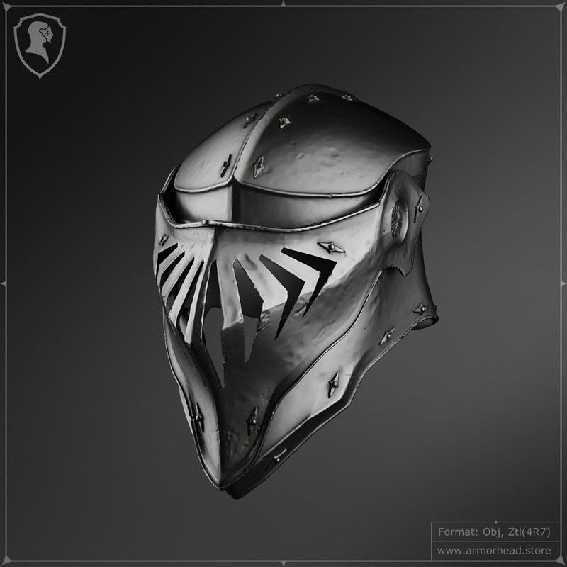

## [back](../index.md) 
# Armorhead
Discover Life's page about the biology, natural history, ecology, identification and distribution of Pentaceros japonicus - Japanese Armorhead -- Discover Life Pentaceros japonicus Dderlein, 1883 JAPANESE ARMORHEAD For a helmet, pick "armorHead." For a chestplate, select "armorBody," and for "arms L" and "arms R" select the respective armor piece. Then, under "Armor texture," select your "X.png" texture for each element you've enabled. Then click the "Properties" tab on the bottom, and select "X.png" for "Armor layer texture" in this menu. If neither of those appeal, there's plenty more options on this list including Armorhead. Vote up all the names you think are the best sounding for a Pokémon like Relicanth, and be sure to add your own creative nicknames for other aspiring Pokémon masters to use! Don't be afraid to get creative! 1. 14 votes. Armorhead. 2. 13 votes. Boomer. 3. Tropical Climate: The Amazon Basin, which is the core habitat of Armored Catfish, experiences a tropical climate. This region is characterized by high temperatures year-round, with minimal temperature fluctuations. The average temperature ranges from 72°F to 82°F (22°C to 28°C). Wet Season and Dry Season: The Amazon Basin experiences ... Armorhead drawing. Despite their bulk, the Gorgelands subspecies is capable of scaling treacherous terrain with ease, reaching the choicest of waxy desert plants. They use their massive heads not only to shield themselves, but to threaten dragons with aggressive displays.

