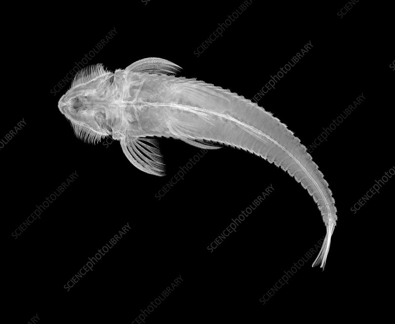

## [back](../index.md) 
# Armoured catfish (disambiguation)
Freshwater Habitats: Armored Catfish are predominantly freshwater inhabitants. They are often found in slow-moving or still waters, such as rivers, streams, and lakes. Preference for Warm Waters: These catfish thrive in tropical and subtropical climates, preferring water temperatures between 72°F to 82°F (22°C to 28°C). Anatomy and Physical Features. Armored catfish have streamlined bodies that enable them to navigate through the water with ease. Their fins, positioned on different parts of their body, allow them to maintain stability and maneuverability. Their mouth is located on the underside of their body, allowing them to scavenge for food on the riverbed. The armored catfish reffles its way across land when it finds itself at a dead end in its present habitat. It may be that the isolated body of water it was living in has run out of food or some ... The armored ‍catfish, also known as the⁣ Plecostomus ‍or Armored sucker catfish,⁣ is a⁣ unique species of fish that is valued for its ability to clean algae from aquariums and ⁣its distinctive armored⁣ appearance. With its hard and protective body armor, this species has long been a popular choice ‍for freshwater aquarium ... Armored catfish (Pterygoplichthys spp.) are one example of a fish species that has been moved around the world by the aquarium trade and has become invasive in water bodies on several continents. Armored catfish are a successful invasive species for a few reasons. First, they can survive in a wide range of water conditions.

