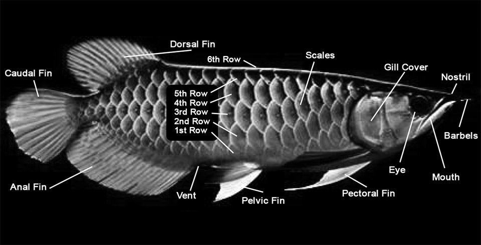

## [back](../index.md) 
# Arowana
The prehistoric arowana is a long, sleek, streamlined fish of great beauty with a unique character. Arowanas have a distinct scale pattern and are found in an array of colors, including silver, gold and even red. They are a large, predatory species with an aggressive disposition. They have the potential to grow rapidly, up to 2 inches per month. Arowana are large, freshwater fish with colorful scales and a legendary status in Asian culture. They come in different colors and sizes, and have a high price tag in the aquarium trade. Learn about their origin, habitat, species, Feng Shui, conservation status, and more. Learn about the unique features, origin, and price of Arowanas, a species of fish with a boney lower jaw and a bone plate on the lower part of their mouth. Find out the different types of Arowanas, such as Asian, Silver, African, and Jardini Arowanas, and how they are related to the Dragon Fish in Asian culture. Learn about the types, appearance, behavior, and requirements of Arowana fish, a large and aggressive species that can be found in several colors and patterns. Find out how to care for Arowana fish in a large tank with special conditions and what to feed them to ensure their health and longevity. Arowana is a monster fish. As such, it should only follow that a monster fish needs a monster tank. The absolute minimum tank size for a solitary arowana (with possibly a few tank mates) is: 220 gallons (6' x 2.5' x 2') for a South American arowana. 120 gallons (4' x 2' x 2') for an Asian or Australian arowana.

