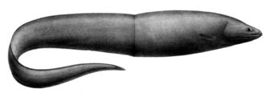

## [back](../index.md) 
# Arrowtooth eel (disambiguation)
In 2022, commercial landings of arrowtooth flounder totaled 38 million pounds and were valued at $3.0 million, according to the NOAA Fisheries commercial fishing landings database . Although arrowtooth flounder are a low-value fish, fishermen have been retaining more of the arrowtooth they catch—up to about 80 percent in Alaska. Citation: Pseudo-chromosome-length genome assembly for the deep-sea eel Ilyophis brunneus sheds light on deep-sea adaptation (2023, March 27) retrieved 31 December 2023 from https://phys.org ... Making sense of a mystery fish. Scientists tackle long-standing questions about the elusive American eel. Glass eels are typically caught and sent to Asia, where the fish are raised to adulthood and then sold as food. (Photo by Chris Bowser/NYSDEC) In her book, Under the Sea-Wind, Rachel Carson described how the American eel makes its journey ... To investigate the molecular mechanisms of deep-sea adaptation in the eel, the researchers first sequenced and assembled a high-quality genome of the MAE using Illumina high-throughput sequencing ... The researchers identified the eel as a muddy arrowtooth eel (MAE) through morphological observation and mitochondrial barcoding analysis. To investigate the molecular mechanisms of deep-sea adaptation in the eel, the researchers first sequenced and assembled a high-quality genome of the MAE using Illumina high-throughput sequencing, PacBio ...

