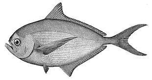

## [back](../index.md) 
# Atlantic pomfret
The Atlantic Pomfret, also known as Ray's Bream or the Pomfret Bream, is found in the Atlantic Ocean and the Mediterranean Sea. It features a more rounded body shape compared to other pomfret species, with a silver-grey colouration. Atlantic Pomfret offers a mild and slightly sweet flavour, making it a popular choice for grilling, baking, or ... Bigscale pomfret live in deep waters in the Atlantic Ocean and the Gulf of Mexico. NCEQ. SHARE. Late last week, North Carolina announced a new record for a species of saltwater fish called ... 1. Tilapia. "Sure, tilapia is a lean source of protein, but it lacks the omega-3 content of fatty fish like salmon, tuna, herring and sardines," says Zumpano. Most people don't get enough ... Atlantic pomfret, also known as angel fish is the most popular among all types. The white and medium-sized pomfret is the one available in India and other countries that are connected with the Bay of Bengal. Because of its soft bones, this fish is relished by most of the people in those countries. It has delicate white flesh that becomes soft ... Steaming black pomfret is a healthy and easy way to cook this delicious fish. To prepare a simple steamed black pomfret Chinese style, first, clean the fish and remove the scales. Then, season it with salt and pepper and stuff it with ginger and spring onion. Steam the fish for about 10-15 minutes until it's cooked through.

