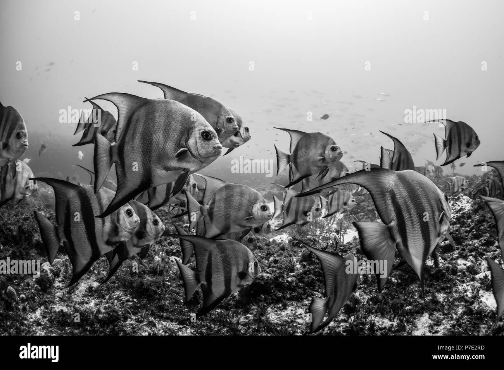

## [back](../index.md) 
# Atlantic spadefish
The Atlantic Spadefish has a relatively small mouth and can't take a hook too large. If your hook is too big, chances are you won't catch any Spadefish, you'll just lose all of your bait. The idea hook size for the Atlantic Spadefish would be a 1/0 hook and cut up chunks of whatever bait you're using. Fishing for the Atlantic Spadefish ... In February 2020, a single individual of Atlantic spadefish, Chaetodipterus faber, was captured in the Canary Islands (NE Atlantic Ocean). Its morphology and external features were analyzed and described. As this species is native to the western Atlantic Ocean, its detection near the commercial harbour supports the hypothesis of 'trans-Atlantic route' facilitated by oil platforms or ... Since most estuaries are protected areas from storms and strong currents and supply a great deal of food, this becomes a premier habitat for those early stages of some of our favorite game fish. Offshore species like Atlantic spadefish, black sea bass, and cobia once called our little estuaries home. They were Atlantic spadefish from the North Carolina Aquarium at Pine Knoll Shores in Pine Knoll Shores, N.C.; lookdowns from the New England Aquarium and its longtime partner institution, Roger Williams University in Bristol, R.I.; and neon gobies from the National Aquarium. New England and Roger Williams University were late in delivering ... The Atlantic Spadefish - Chaetodipeterus, as it is also known in scientific circles, is a species of marine fish that is native to the waters of the North Atl

