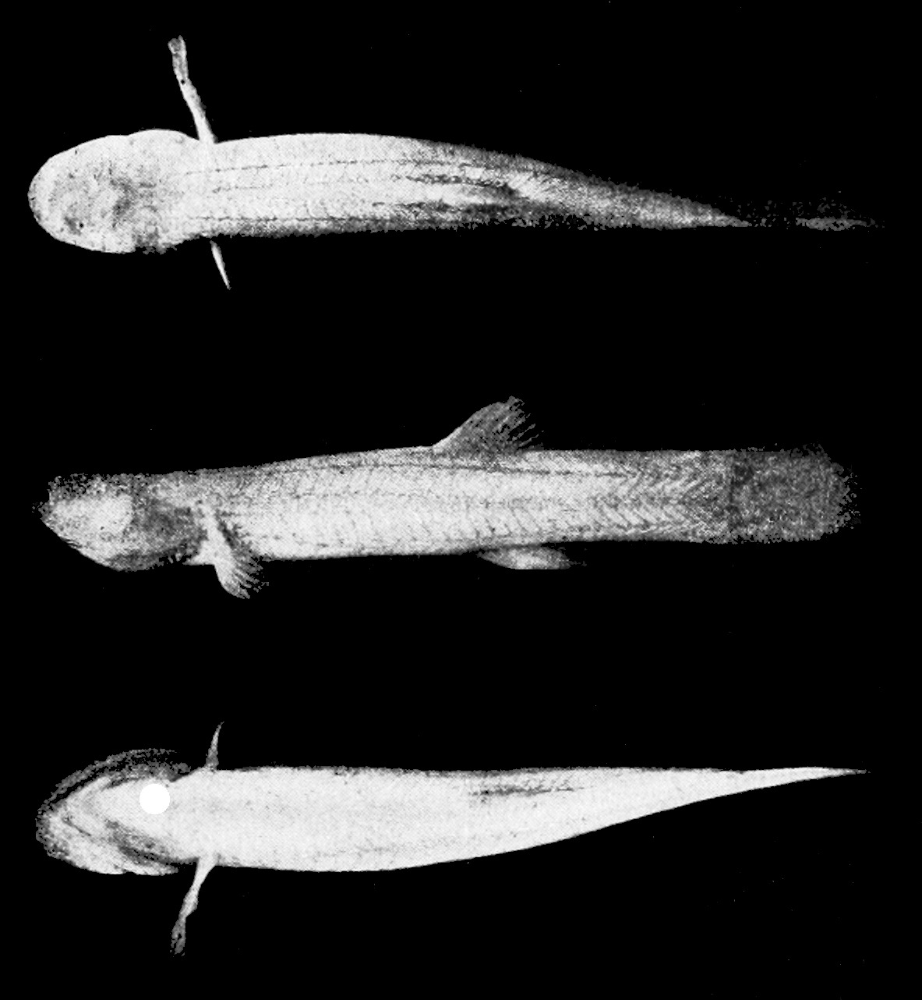

## [back](../index.md) 
# Cave angelfish
A 2-inch long flame angelfish is seen hiding in a cave in Kaua'i. Courtesy of Terry Lilley. A 14-inch long masked angelfish is seen in Palau. Diving with angelfish in Palau, Caribbean, Indonesia ... Yes, Angelfish do require ample room because of their size and temperament. As they mature, sufficient space is vital for free swimming and properly arranged hiding spots. Tank Size: A pair of adult Angelfish need at least 30 gallons. For more or community setups, opt for larger tanks. Cave Angelfish - Freshwater fish. 3D Model. FloridaMuseum. premium. Follow. 438. 438 Views. 16 Like. Add to Embed Share Report. Triangles: 1.1M. Vertices: 551.5k. More model information. Skeleton of a Cave Angelfish, also known as a waterfall climbing cave fish, Cryptotora thamicola, from the Maejo Aquatic Resources Natural Museum (MARNM 6183 ... Temperature: 76°F to 86°F. PH: 6.5-7.5. Genus: Pterophyllum. Species: Scalare. Most freshwater angelfish you find in fish stores are about 3-4 months old, and between the size of a quarter to a silver dollar. While small and adorable, those little fish won't stay small. Angelfish can grow up to 6" long, from nose to tail and most of an ... The blind algivorous cave angelfish of the Balitoridae family from Mae Hong Son Province, Thailand, reaches up to 2.8 cm (1.1 in). It can grab on terrain and climb up the rocks of fast-flowing waterfalls, just like terrestrial vertebrates. This walking behavior is a unique example of convergent evolution into a tetrapod.

