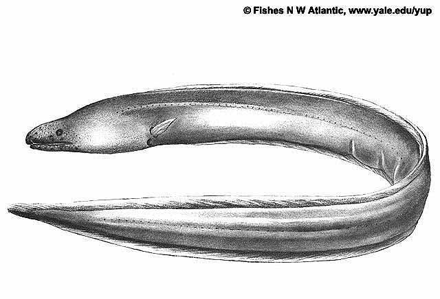

## [back](../index.md) 
# Dysomma anguillare
The shortbelly eel (Dysomma anguillare Barnard, 1923) is a benthic warm-water Anguilliformes species, which is characterized by an anterior anus that is below tip of pectoral fin and approaches to gill cavity (Fig. 1).It naturally distributes in water depths of 30-270 m widely across the neritic zone of Indo-West Pacific and western Atlantic Ocean (Nelson et al. 2016). [Objective] The mitochondrial genome structural characteristics and phylogenetic relationships of Dysomma anguillare were investigated so as to provide theoretical basis for species identification and germplasm resource assessment of this fish. [Method] The complete mitogenome of D. anguillare was obtained by high-throughput sequencing technology in this study. The shortbelly eel, Dysomma anguillare Barnard, 1923, is an essential component in the food chain of the marine ecosystem and plays an important role in nearshore fisheries and biodiversity in the ... Microsatellite loci were screened from the genomic data of Dysomma anguillare and their composition and distribution were analysed by bioinformatics for the first time. The results showed that ... Dysomma anguillare is a demersal eel widespread distributing in tropical waters of the Indo-West Pacific and Atlantic. As an important component of the coastal fishery and marine ecosystem, the lack of genomic information for this species severely restricts the progress of relevant researches. In this study, the abecedarian genome-wide ...

