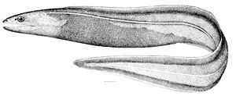

## [back](../index.md) 
# Histiobranchus bathybius
Discover Life's page about the biology, natural history, ecology, identification and distribution of Histiobranchus bathybius - Deepwater Arrowtooth Eel -- Discover Life Histiobranchus infernalis Gill, 1883 · unaccepted Synaphobranchus bathybius Günther, 1877 · unaccepted Synaphobranchus infernalis (Gill, 1883) · unaccepted The body of an eel has a slimy coating, hence the phrase, "Slippery as an eel." The most dangerous eel species is the conger. Although these fish are very snakelike in appearance, they are actually fish. They are ray-finned fishes of the order Anguilliformes, with the term "eel" referring to snake-like fish such as electric, ribbon, wolf eels, lampreys, and morays along with true eels ... Deep-Sea Sole (Embassichthys bathybius) A deep sea sole, surrounded by clam shells, documented during the NSF-OOI Cabled Array cruise to Southern Hydrate Ridge (~ 800 m water depth). Credit. UW/NSF-OOI/WHOI, V18. The Deep-Sea Sole is a bathydemersal flatfish. It lives along the sea floor and has both its eyes on one side allowing for it to look ... Species Histiobranchus australis (Regan, 1913) Species Histiobranchus bathybius (Günther, 1877) Species Histiobranchus bruuni Castle, 1964 Species Histiobranchus infernalis Gill, 1883 accepted as Histiobranchus bathybius (Günther, 1877) Environment. marine, brackish, fresh, terrestrial. Original description. Not documented. Taxonomic citation.

