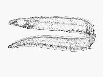

## [back](../index.md) 
# Ilyophis brunneus
They reported the first high-quality genome of a deep-sea eel (Ilyophis brunneus), which sheds light on the molecular mechanisms of deep-sea adaptation. The deep-sea eel sample was obtained by ... They reported the first high-quality genome of a deep-sea eel (Ilyophis brunneus), which sheds light on the molecular mechanisms of deep-sea adaptation. The deep-sea eel sample was obtained by China's manned submersible, " Shen Hai Yong Shi," at a depth of 3,500 meters in the Mariana Trench. The researchers identified the eel as a muddy ... Pseudo-chromosome-length genome assembly for a deep-sea eel Ilyophis brunneus sheds light on the deep-sea adaptation . Science China Press. Journal Science China Life Sciences DOI 10.1007/s11427 ... They reported the first high-quality genome of a deep-sea eel (Ilyophis brunneus), which sheds light on the molecular mechanisms of deep-sea adaptation. The deep-sea eel sample was obtained by China's manned submersible, " Shen Hai Yong Shi," at a depth of 3,500 meters in the Mariana Trench. The researchers identified the eel as a muddy ... A sister relationship between D. anguillare and Synaphobranchidae species was discovered, which demonstrated that D. anguillare was closely related to Simenchelys parasitica, Ilyophis brunneus and Synaphobranchus kaupii. At present, various taxonomic references have different taxonomic positions for D. anguillare.

