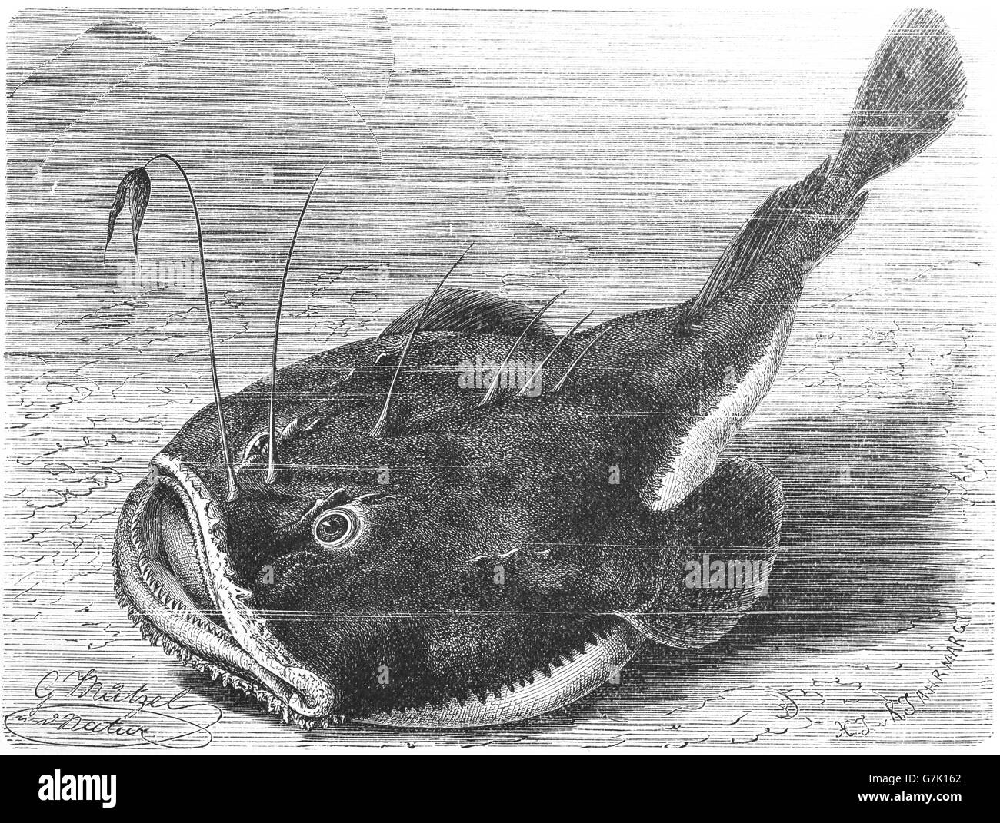

## [back](../index.md) 
# Lophius piscatorius
Additionally, it has been observed that Lophius piscatorius can even prey on seabirds, such as seagulls, in shallow waters. The monkfish's diet suggests that it is an opportunistic feeder, eating whatever it can catch, making it a formidable predator in the ocean. Reproduction of Giant Monkfish The current work aimed to check the reliability of a plasmid-based calibrator for detecting and quantifying the β-pvalb gene in Lophius piscatorius. The developed plasmid was successfully cloned with our target gene (second intron of pvalb; 196 bp) and showed high efficiency, repeatability and stability. The plasmid DNA calibrator performed ... The Lophius piscatorius has a milder flavor and a softer texture. Where to Buy Monkfish: Monkfish can be purchased at most seafood markets or online. It is important to consult with the store personnel to make sure the monkfish is fresh before purchasing. It is also important to check the storage and temperature guidelines to ensure the ... The largest species of monkfish, reaching 78.7 inches (200 cm) and weighing up to 127 pounds (57.7 kg). Coastlines of China to Japan and Korea. Lophius litulon. Yellow goosefish. Reaches depths of 560 meters. Specimens have reached five feet (150 cm) in length. A popular high-end dish in Japan. The benchmark workshop on anglerfish (Lophius budegassa, Lophius piscatorius) and hake (Merluccius merluccius) (WKANGHAKE) was the first ICES benchmark entirely dedicated to assessment models run with the integrated model Stock Synthesis (SS) software.Besides the data workshop, which was held in November 2021, several online sessions were held on a continuous basis with all participants ...

