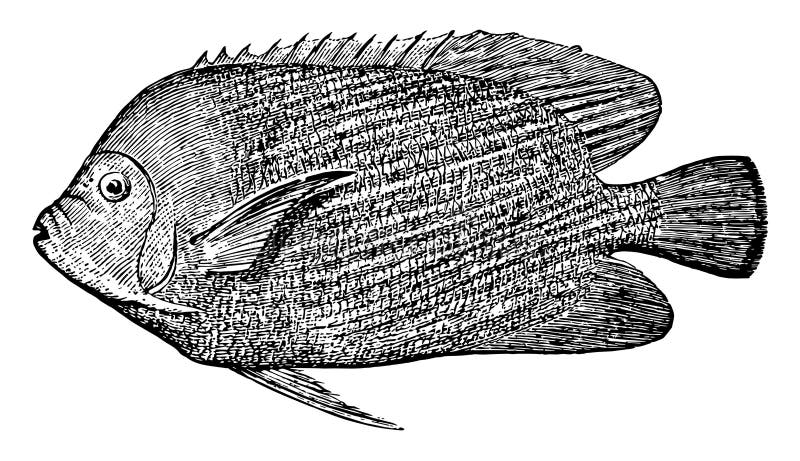

## [back](../index.md) 
# Pomacanthidae
Genicanthus semifasciatus SIZE: to 21 cm (8 in.) Angelfishes - Pomacanthidae. ID: Mole - White with numerous close-set wavy bars on upper body, yellow on head extends into a yellow mid-body stripe; yellow spots on dorsal and tail fins. Usually form same-sex groups. Rock or coral reefs in 15-100 m. Pomacanthidae: Scientific Name: Centropyge loriculus: Common Names: Flame angel, red angelfish, Japanese pygmy angelfish, flaming angelfish: IUCN Red List Status: Least Concern: Appearance: Red/orange oval body, rounded fins with black stripes and blue edging on fins: Size: Up to 10 cm (4 in) Lifespan: 5-7 years: They are members of the Pomacanthidae family, a descriptive name for these preopercle-spine fish derived from the Greeks, with "Poma" meaning cover and "akantha" meaning thorn. Saltwater Angelfish Species. Angelfish are members of the Perciformes Order, the perch-like, Ray-finned or Bony Fishes. This order of fishes originated more than ... Marine angelfish are perciform fish of the family Pomacanthidae. They are found on shallow reefs in the tropical Atlantic, Indian, and mostly western Pacific... Pomacanthidae: Genus: Pomacanthus: Species: Pomacanthus annularis: Common Name: Blue Ring Angelfish, Annularis Angelfish, Blue King Angelfish: Care Level: Difficult: Size: Up to 18 inches (45 cm), most get up to about 12 inches (30 cm) Lifespan: 15 - 20 years, possibly longer: Temperature: 72°F - 76°F (22°C - 24°C) pH: dKH 8 - 12 ...

