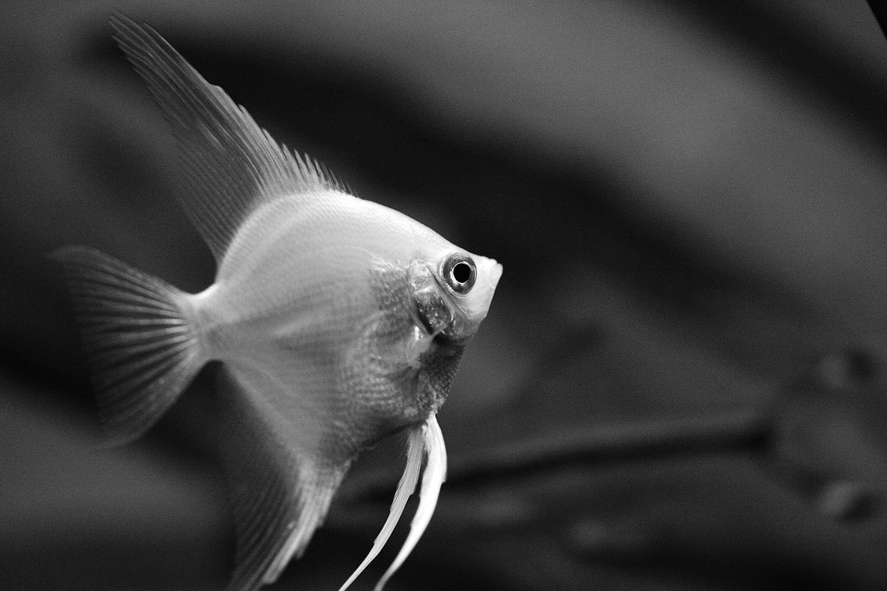

## [back](../index.md) 
# Pterophyllum
8. Silver Angelfish (Pterophyllum scalare var. Silver) The silver angelfish most closely resembles common angelfish. They serve as the original genetic material for most of the other types aquarists clamor for. They're also the hardiest and easiest to care for, making them the top choice for novices. Wild Freshwater Angelfish Facts. Freshwater angelfish are new-world cichlids of the genus Pterophyllum. In the wild, they inhabit the rivers and streams of the Amazon River Basin and other tropical regions of South America. This fish thrives in flooded forests and dense vegetation, which can be replicated in the home aquarium. Altum Angelfish (Pterophyllum altum) Food and Diet. The diet of any pet is extremely important. A varied and healthy diet will help ensure that your pet lives a long, happy, and healthy life. Altum Angelfish are an omnivorous fish species, meaning they prefer to eat meat and plant matter. Altum Angelfish don't usually eat pellets or flakes ... Temperature: 76°F to 86°F. PH: 6.5-7.5. Genus: Pterophyllum. Species: Scalare. Most freshwater angelfish you find in fish stores are about 3-4 months old, and between the size of a quarter to a silver dollar. While small and adorable, those little fish won't stay small. Angelfish can grow up to 6" long, from nose to tail and most of an ... Pterophyllum scalare; Pterophyllum scalare includes multiple varieties of angelfish commonly kept in the aquarium hobby, including the Common or Silver, Zebra, Zebra Lace, Blue Zebra, Albino, Ghost, Black Ghost, and Veiltail angelfishes. This species is the hardiest and most widely available in the aquarium trade.

