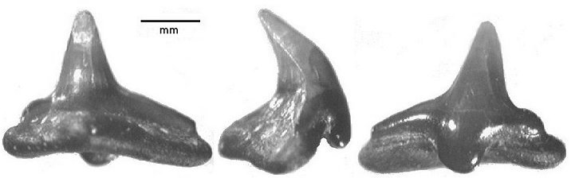

## [back](../index.md) 
# Squatinidae
The monotypic order Squatiniformes, with its monotypic family Squatinidae Bonaparte, 1838 containing the monotypic genus Squatina Duméril, 1806, presently contains 23 valid species worldwide. Four of the five Indian Ocean species occur in the eastern Indian Ocean while only one, S. africana Regan, 1908, occurs in the western Indian Ocean ... Angelshark, also known as monkfish, fiddle fish, or sand devil, is a type of shark that belong to the family Squatinidae. They are known for their angelic and flattened appearance, making them look similar to rays. The angelshark's body is comprised of various organ systems, each with its unique function. The Angelshark is a member of the family Squatinidae, a group of unusual sharks known for their flattened body and broad pectoral fins. This genus Squatina is the only genus in this family and the order Squatiniformes as well. FAMILY SQUATINIDAE ANGEL SHARKS Angelsharks are unusually shaped shark characterised by a flattened ray-blue head and body, with a well defined neck at the origin of the pectoral fin; greatly expanded pectoral and pelvic fins, and very small dorsal, anal, and tail fins; 5 gill slits situated under the body and a large spiracle behind each eye. It is no longer observed in many areas of the Mediterranean and is rare throughout the rest of its range. The main threat to the smoothback angelshark is commercial fishing, particularly by demersal fisheries, like trawl fisheries, that primarily operate in depths where the smoothback angelshark occur. In 2016, NOAA Fisheries listed the species ...

