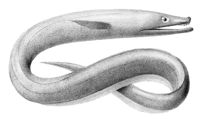

## [back](../index.md) 
# Synaphobranchus kaupii
Synaphobranchus kaupii Picture by DESCNA Classification / Names Common names | Synonyms | Catalog of Fishes( genus , species ) | ITIS | CoL | WoRMS | Cloffa Teleostei (teleosts) > Anguilliformes (Eels and morays) > Synaphobranchidae (Cutthroat eels) > Synaphobranchinae Etymology: Synaphobranchus: Greek, syn, symphysis = grown together + Greek ... Scientific name: Synaphobranchus kaupii Author: Johnson 1862 Rank: Species Status: valid Images of Synaphobranchus kaupii Common names: longnosed eel (English) Synonyms: = Synaphobranchus kaupi Johnson 1862 = Synaphobranchus pinnatus Gronow in Gray 1854 Page counter: 118 (Average: 17.9765) arrowtooth eel Synaphobranchus kaupii Johnson, 1862 in . the western North Paci c o the sou th coast of Hokkaido . were previously sent to m e by the sta of the Hokkaido . Species Synaphobranchus affinis Günther, 1877; Species Synaphobranchus brevidorsalis Günther, 1887; Species Synaphobranchus kaupii Johnson, 1862; Species Synaphobranchus kaupi Johnson, 1862 accepted as Synaphobranchus kaupii Johnson, 1862 (misspelling) Synaphobranchus kaupii Johnson, 1862. Rank. Species Parent. Synaphobranchus Johnson, 1862. Orig. name. Synaphobranchus kaupii Johnson, 1862. Environment. marine, brackish, fresh, terrestrial. Original description (of Synaphobranchus kaupii Johnson, 1862) Johnson, J. Y. (1862). Descriptions of some new genera and species of fishes obtained at ...

